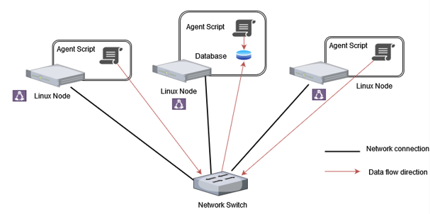

# Linux Cluster Monitoring Agent
# Introduction
The Linux Cluster Monitoring Agent (LCM) is a set of bash scripts that provide the functionality to monitor and log resource usage of every node in a cluster. 
The agent collects hardware information on every node and also collects data on CPU, memory, and disk usage for every node every minute.
The data is stored in a PostgreSQL database provisioned using Docker. The LCM is an invaluable tool which provides Linux cluster usage data which can be accessed by an LCA team to 
assess system performance and plan for future resource allocation. 

# Quick Start
1. Create a psql container using ```bash psql_docker.sh create <db_username> <db_password>```, or start an existing one using ```bash psql_docker.sh start```.
2. Create the host_info and host_usage tables using ```psql -h localhost -U <db_username> -d host_agent -f ddl.sql```. 
3. Insert hardware specs data into the DB by running ```bash host_info.sh```.
4. Setup a cron job to run the host_usage.sh script every minute using ```crontab -e``` and by adding the following line: 
```* * * * * bash <absolute path to host_usage.sh> "localhost" 5432 "host_agent" <db_username> <db_password> &> /tmp/host_usage.log```.

# Implemenation
The pdql_docker.sh script was created using bash to create, start, or stop the psql Docker container.
Created a ddl.sql script to create the host_usage and host_info tables if they don't exist. \
Created a host_info.sh script which runs once to collect the node hardware information. \
Scheduled a new job using `crontab` to run the host_usage.sh script every minute which collects node CPU, memory, and disk usage information.

## Architecture


## Scripts
#### psql_docker.sh
Used to create, start, or stop the PostgreSQL Docker container. \
To create a new container: ```bash psql_docker.sh <db_username> <db_password>```. \
To start or stop an existing container: ``````bash psql_docker.sh { start | stop }``````.

#### host_info.sh
Collects data on the host machine specifications to insert into the host_info table. \
Run using ```bash host_info.sh "localhost" 5432 "host_agent" <db_username> <db_password>```.

#### host_usage.sh
Runs at 1 minute intervals to collect server usage data on CPU. memory, and disk. Stored in the host_usage table. \
Run using ```bash host_usage.sh "localhost" 5432 "host_agent" <db_username> <db_password>```.

#### crontab
Use ```crontab -e``` to add a new job for the linux task scheduler. \
Add the following line to run the task every minute: 
```* * * * * bash <absolute path to host_usage.sh> "localhost" 5432 "host_agent" <db_username> <db_password> &> /tmp/host_usage.log```.

## Database Modeling
### host_info

  | id  | hostname | cpu_number | cpu_architecture | cpu_model | cpu_mhz | l2_cache | timestamp | total_mem |
  |-----|----------|-----|----------|-----------|-------|----------|-----------|---------|
  | 1   | jrvs-remote-desktop   | 1   | x86_64   | Intel(R) Xeon(R) CPU @ 2.30GHz  | 2300  | 256      |   2019-05-29 17:49:53.000   | 601324  |
- `id`: Unique primary key, automatically generated in a serial manner.
- `hostname`: Name of the host machine.
- `cpu_number`: Number of CPU cores.
- `cpu_architecture`: The CPU architecture.
- `cpu_model`: The model of the CPU.
- `cpu_mhz`: The clock speed of the cpu (MHz).
- `l2_cache`: Size of the L2 Cache (kB).
- `timestamp`: Timestamp at the time the data is collected.
- `total_mem`: Total memory available on this machine (MB).

All fields are required.

### host_usage

| timestamp | host_id | memory_free | cpu_idle | cpu_kernel | disk_io | disk_available |
|-----------|---------|-------------|----------|------------|---------|----------------|
| 019-05-29 17:49:53.000   | 1       | 256         | 95       | 0          | 31220   | 256|

- `timestamp`: Timestamp at the time the data is collected.
- `host_id`: Id of the machine on which the data is being collected on. A foreign key, relating to the host_info table.
- `memory_free`: Free memory available (MB).
- `cpu_idle`: Percentage of time that the CPU is idle.
- `cpu_kernel`: Percentage of time the CPU spends executing kernel code.
- `disk_io`: Number of blocks read from and written to disk per second.
- `disk_available`: Space available in the file system (MB). 

All fields are required.

# Test
#### psql_docker.sh
Script was tested first by creating a new psql instance, and trying to connect to it using ```psql -h localhost -U <db_username> -W```.
The script was then stopped, and verified by trying to connect to it, resulting in an error.
The script was then started and verified by successfully connecting to it.

#### host_info.sh
Tested by running the script and checking the database to ensure correct system information is inserted into table.

#### host_usage.sh
Tested by running the script and checking the database to ensure correct system usage information is inserted into table.
Test data was also manually inserted to verify correctness.

#### crontab
Tested by creating new job, and checking the database every minute to ensure a new entry is created with the correct information.
Test data was also manually inserted to verify correctness.

#### ddl.sql
Verified by running the script on an empty database and ensuring 2 new tables (host_usage and host_info) are created.

# Deployment
The source code is hosted on GitHub, which can be cloned and deployed locally using Docker to instantiate a psql instance.
A new job can be scheduled by using ```crontab``` to ensure the host_usage.sh script runs every minute to collect system usage information.

# Improvements
- At the moment there is no method of detecting a hardware change and updating the entry in the host_info table. In the future I would like to implement this functionality.
- I would like to extend the extent to which data is collected, such as network I/O data and allow the user to measure application specific usage.
- I would like to add some alert functionality, such that it alerts the user when the server usage exceeds their set limit, i.e., CPU idle time drops below 20% for more than 5 hours.
